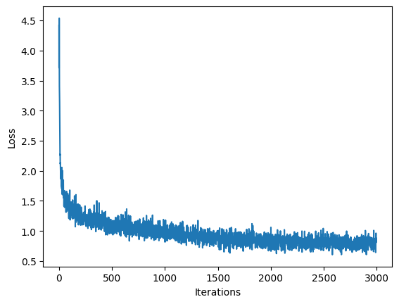

# 🎵 Music Generation with RNNs

Generate original Irish folk music using deep learning! This project implements a character-level Recurrent Neural Network (LSTM) that learns patterns from thousands of songs in ABC notation and creates entirely new musical compositions.

## Overview

This project demonstrates how sequence models can learn the structure of music and generate creative outputs. By training on a dataset of Irish folk songs, the model learns:

- Musical patterns and structures
- ABC notation syntax and conventions
- Rhythm, melody, and harmonic relationships
- Song metadata (titles, keys, tempo)

## Quick Start

### Environment Setup

Create a virtual environment and install dependencies:

```bash
# Create virtual environment
python -m venv venv

# Activate environment
# On macOS/Linux:
source venv/bin/activate
# On Windows:
# venv\Scripts\activate

# Install dependencies
pip install -r requirements.txt
```

### Running the Notebook

```bash
jupyter notebook Music_Generation.ipynb
```

## What is ABC Notation?

ABC notation is a text-based music notation system that uses ASCII characters to represent musical notes, rhythms, and structures. Example:

```
X:1
T:Speed the Plough
M:4/4
L:1/8
K:G
|:GABc dedB|dedB dedB|c2ec B2dB|c2A2 A2BA|
```

## Model Architecture

The model uses an LSTM-based architecture:

1. **Embedding Layer**: Converts character indices to dense vectors (256-dim)
2. **LSTM Layer**: Processes sequences and maintains temporal state (1024 hidden units)
3. **Dense Output Layer**: Projects to vocabulary size with softmax

```
Input (batch, seq_len)
  → Embedding (batch, seq_len, 256)
  → LSTM (batch, seq_len, 1024)
  → Linear (batch, seq_len, vocab_size)
  → Softmax → Predicted characters
```

## Key Features

- **Character-level prediction**: Predicts the next character given a sequence
- **Temperature sampling**: Control creativity vs. coherence in generation
- **Experiment tracking**: Integration with Comet ML for monitoring training
- **Checkpoint saving**: Save and resume training at any point
- **Audio playback**: Convert generated ABC notation to playable audio files

## Training


_Training loss convergence over iterations_

### Hyperparameters

```python
num_training_iterations = 3000
batch_size = 8
seq_length = 100
learning_rate = 5e-3
embedding_dim = 256
hidden_size = 1024
```

### Training Process

1. Load and vectorize the Irish folk song dataset
2. Create training batches with sequence length = 100
3. Train LSTM to predict next character at each time step
4. Monitor loss convergence (expect ~1.5-2.0 final loss)
5. Save model checkpoints every 100 iterations

## Music Generation

Once trained, generate new music by:

1. Providing a seed string (e.g., "X")
2. Iteratively sampling from the model's predictions
3. Converting ABC output to audio format
4. Playing back the generated song

## Expected Results

- **After 500 iterations**: Basic ABC syntax, some valid notes
- **After 1500 iterations**: Recognizable musical patterns
- **After 3000+ iterations**: Coherent melodies and song structures

## Resources

- [ABC Notation Guide](https://en.wikipedia.org/wiki/ABC_notation)
- [Understanding LSTMs](http://colah.github.io/posts/2015-08-Understanding-LSTMs/)
- [MIT Deep Learning Course](http://introtodeeplearning.com)
- [PyTorch LSTM Documentation](https://pytorch.org/docs/stable/generated/torch.nn.LSTM.html)

## Learning Objectives

By completing this project, you will:

- Understand how RNNs/LSTMs process sequential data
- Learn to implement character-level language models
- Practice hyperparameter tuning for deep learning
- Experience creative applications of AI in music
- Gain hands-on experience with PyTorch/TensorFlow
  PyTorch LSTM Documentation](https://pytorch.org/docs/stable/generated/torch.nn.LSTM.html)

## Learning Objectives

By completing this project, you will:

- Understand how RNNs/LSTMs process sequential data
- Learn to implement character-level language models
- Practice hyperparameter tuning for deep learning
- Experience creative applications of AI in music
- Gain hands-on experience with PyTorch/TensorFlow

## Contributing

Contributions are welcome! Feel free to:

- Open issues for bugs or feature requests
- Submit pull requests to improve the code
- Share your generated music compositions
- Suggest improvements to the model architecture

## License

This project is licensed under the MIT License - see the [LICENSE](LICENSE) file for details.
